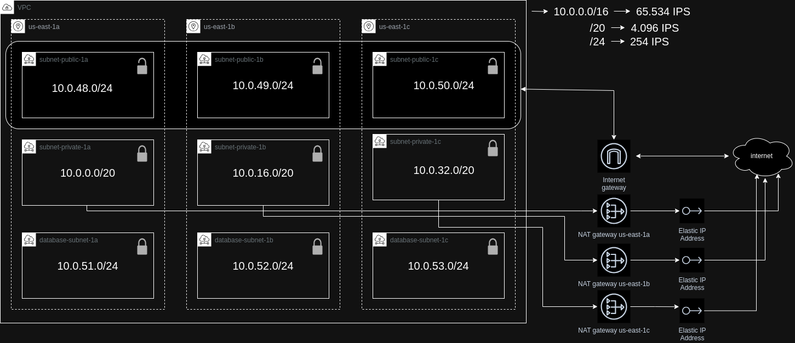

# aws-vpc

🏗️📦☁️ Repositório da aula de VPC do curso Arquitetura de Containers na AWS da LINUXTips - ministrado pelo [Matheus Fidelis](https://github.com/msfidelis)

<br>

## Programas necessários

Para desenvolver o projeto, é necessário instalar o [Terraform Switcher](https://tfswitch.warrensbox.com/Install/) e o [AWS CLI](https://docs.aws.amazon.com/pt_br/cli/latest/userguide/getting-started-install.html).

## Usuário na AWS

Criação do usuário na aws com acesso de admin na conta e geração das keys de acesso a conta.

<br>

## O que foi desenvolvido



> Imagem copiada do [Repositório do Alex Soares](https://github.com/So4resAlex/aws-containers-vpc)

O primeiro passo do projeto foi a criação de uma `VPC`. Em seguida definimos as `subnets privadas`, `subnets publicas` e `databases`. Como configuração adicional, desenvolvemos a `internet gatway`, `nat gateway` e `routing table`.

<br>

## Tecnologias utilizadas

 

<br>

## Terraform

Para padronizar a identação dos arquivos terraform, rodar o comando:

```bash
terraform fmt --recursive
```

Fazer deploy das alterações:

```bash
terraform apply --auto-approve -var-file=environment/dev/terraform.tfvars
```

Para excluir algum recurso criado:

```bash
terraform destroy --auto-approve -var-file=environment/dev/terraform.tfvars
```

<br>

## Utilitários

README modelo: [Repositório do Alex Soares](https://github.com/So4resAlex/aws-containers-vpc)
